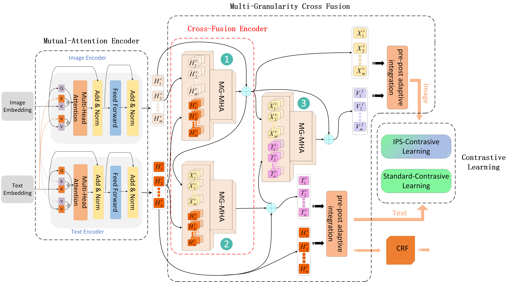

# MCIPS-CL

## Architecture




Our code is based on Python 3.8.18 and PyTorch 2.1.0. Requirements are listed as follows:
> - torch==2.1.0
> - transformers==4.26.0
> - numpy==1.23.5
> - tqdm==4.66.1
> - seqeval==1.2.2
> - hydra-core==1.0.6
> - tensorboard==2.4.1
> - matplotlib==3.4.1
> - jieba==0.42.1
> - scikit-learn==0.24.1
> - opt-einsum==3.3.0
> - wandb==0.12.7
> - ujson==5.6.0
> - huggingface_hub==0.11.0
> - tensorboardX==2.5.1
> - nltk==3.8
> - protobuf==3.20.1
> - ipdb==0.13.11
> - pytorch-crf==0.7.2
> - openai==0.28.0
> - Jinja2==3.1.2
> - datasets==2.13.2
> - pyhocon==0.3.60


We highly suggest you using [Anaconda](https://www.anaconda.com) to manage your python environment.

## Dataset
The MNRE dataset comes from https://github.com/thecharm/Mega, many thanks.
```wget 120.27.214.45/Data/ner/multimodal/data.tar.gz```
Place the dataset in the file 'example/ner/multimodal/data'
## How to install
```
pip install -r requirements.txt
python setup.py install
```
## How to Run

### Quick start
The script **run.py** acts as a main function to the project, you can run the experiments by replacing the unspecified options in the following command with the corresponding values:

```shell
    cd example/ner/multimodal
    CUDA_VISIBLE_DEVICES=$1 python run.py
```

or run the script **run.py** directly via pycharm.
